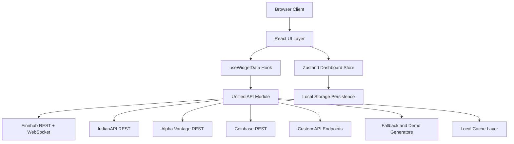
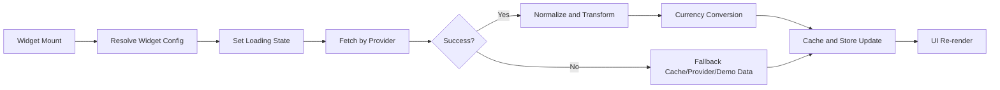

### ⚠️ PROTECTED CODE - DO NOT COPY ⚠️

This is a personal project by Meet Jain. This repository is publicly visible for demonstration purposes only.

Author: Meet Jain
- This project is protected. Do not copy, fork, or reuse without permission.
- Unauthorized use is strictly prohibited. Only the official deployment is allowed to run.

### Legal Protection
This project is protected by copyright law and includes proprietary security measures. Unauthorized use or attempts to circumvent security measures may result in legal consequences.

### Contact
For any inquiries about this project please contact: meetofficialhere@gmail.com

# FinBoard - Customizable Finance Dashboard

A modern, real-time finance dashboard builder that allows users to create customizable widgets for monitoring stocks and financial data through multiple API providers.

## Table of Contents

- [Project Overview](#project-overview)
- [Objectives](#objectives)
- [Use Cases](#use-cases)
- [Core Features](#core-features)
- [System Architecture](#system-architecture)
- [Architecture Diagram](#architecture-diagram)
- [Data Flow / Request Lifecycle](#data-flow--request-lifecycle)
- [Project Structure](#project-structure)
- [Tech Stack & Justification](#tech-stack--justification)
- [Key Design Decisions](#key-design-decisions)
- [Trade-offs](#trade-offs)
- [API Design](#api-design)
- [Data Modeling](#data-modeling)
- [Security Considerations](#security-considerations)
- [Performance Considerations](#performance-considerations)
- [Scalability Approach](#scalability-approach)
- [Observability & Monitoring](#observability--monitoring)
- [Testing Strategy](#testing-strategy)
- [Failure Handling](#failure-handling)
- [Constraints & Assumptions](#constraints--assumptions)
- [Deployment Approach](#deployment-approach)
- [Limitations](#limitations)
- [Future Improvements](#future-improvements)
- [Learnings](#learnings)
- [Author](#author)

## Project Overview

FinBoard is a React + TypeScript dashboard that lets users compose finance views from cards, charts, watchlists, and tables, using multiple data providers (Finnhub, IndianAPI, Alpha Vantage, Coinbase, custom APIs).

It solves a practical problem: market data is fragmented across providers, inconsistent in schema quality, and often unreliable under rate limits. FinBoard unifies that into one configurable UI with fallback behavior and persistent personalization.

Real-world relevance:
- Portfolio monitoring across US equities, Indian markets, and crypto
- Rapid prototyping of data widgets for fintech UI concepts
- Demonstration of production-oriented frontend architecture under unreliable upstream APIs

## Objectives

This project demonstrates:
- Component-driven UI architecture for configurable dashboards
- Multi-provider data abstraction with resilient fallback chains
- Stateful client architecture using persisted global store patterns
- Real-time and polling-based data refresh strategies
- Practical engineering trade-offs in a frontend-only deployment model

## Use Cases

Primary scenarios:
- A user builds a personal dashboard for US stocks with real-time quote cards
- A user switches to an Indian-market template and tracks NSE-focused data
- A user monitors crypto via watchlists and market movers with periodic refresh
- A user integrates a custom JSON endpoint and maps selected fields to a widget

Example flow:
1. Select dashboard template (Starter, Indian Market, Crypto)
2. Add a widget and choose type (card/chart/table/watchlist)
3. Configure symbol(s), refresh interval, currency, display mode
4. Persist and reorder widgets via drag-and-drop
5. Export dashboard layout for portability

## Core Features

### Dashboard Composition
- Multi-dashboard template model
- Drag-and-drop widget ordering
- Persisted layouts and theme state in browser storage
- Export/import dashboard configuration

### Data Ingestion and Resilience
- Unified API service layer for provider-specific normalization
- Provider fallback logic (Finnhub to Alpha Vantage to demo/cache paths)
- Cache-backed recovery for rate limits and transient failures
- Optional WebSocket quote updates for real-time card behavior

### Widget System
- Stock quote cards
- Time-series chart widgets
- Market movers and watchlists
- Searchable/sortable/filterable table widgets
- Custom API widgets with field-path extraction

## System Architecture

High-level components:
- Client: React SPA with route-level page composition
- State layer: Zustand store with persistence middleware
- Data layer: provider-specific API modules + unified orchestration
- Cache layer: in-memory + localStorage cache for degraded-mode continuity
- External services: Finnhub REST/WS, IndianAPI REST, Alpha Vantage REST, Coinbase REST

Architecture style:
- Frontend-heavy, service-module oriented
- No dedicated backend; API integration occurs in-browser via configured endpoints and dev proxying

## Architecture Diagram



This Mermaid source acts as the architecture diagram artifact and can be expanded into deployment-specific diagrams as the system evolves.

## Data Flow / Request Lifecycle



Step-by-step:
1. Widget config determines provider, symbols, interval, and field selection
2. Hook initiates fetch and marks widget as loading
3. Provider module requests upstream data and applies cache lookups
4. Response is normalized into widget-oriented shape
5. Optional currency conversion and field extraction are applied
6. State store updates widget data and timestamps
7. UI refreshes; errors are sanitized and surfaced when needed

## Project Structure

```text
src/
├── components/
│   ├── dashboard/      # Dashboard orchestration and layout grid
│   ├── layout/         # Header and shell components
│   ├── ui/             # Reusable UI primitives
│   └── widgets/        # Widget implementations and widget dialogs
├── hooks/              # Data-fetching and UI hooks
├── lib/                # API services, constants, currency, utilities
├── pages/              # Route-level pages
├── store/              # Zustand state and actions
├── test/               # Vitest setup and test specs
└── types/              # Shared TypeScript contracts
```

Why this structure:
- Separates data orchestration (`lib`, `hooks`, `store`) from rendering (`components`)
- Keeps widget behaviors modular and independently evolvable
- Supports scaling by feature area without collapsing into monolithic components

## Tech Stack & Justification

- React 18 + TypeScript: composable UI with strict contracts
- Zustand: low-overhead global state with persistence middleware
- Vite: fast local iteration and efficient production bundling
- Recharts: practical charting for financial timeseries rendering
- @dnd-kit: robust drag-and-drop interactions for widget layout
- Tailwind + shadcn/ui: consistent, scalable design system foundation
- Vitest + Testing Library: lightweight test execution for component and utility confidence

## Key Design Decisions

- Chose a frontend-only architecture to optimize iteration speed and demonstrability
- Centralized widget and layout state in a persisted store for predictable behavior
- Built provider adapters instead of hard-coding API logic in components
- Prioritized graceful degradation with cache and fallback data over hard failures
- Added dashboard-type context to avoid cross-template state collisions

## Trade-offs

Alternatives considered and outcomes:
- Backend aggregation service vs client-side provider calls: client-side chosen for simplicity and demo velocity; weaker secret management is the cost
- React Query-first data model vs store-driven orchestration: store-centric model chosen for tighter widget lifecycle control
- Strict real-time updates everywhere vs selective WebSocket usage: selective usage reduces complexity and provider pressure

## API Design

FinBoard does not expose a backend API; it consumes external APIs via a typed service layer.

Representative provider interactions:
- Quote retrieval: `getStockQuote(symbol)`
- Timeseries retrieval: `getTimeSeries(symbol, interval)`
- Movers retrieval: `getTopGainersLosers(url?)`
- Custom endpoint retrieval: `fetchCustomApi(url, cacheKey?, headers?)`

Sample request and normalized response:

```http
GET https://finnhub.io/api/v1/quote?symbol=AAPL&token=<token>
```

```json
{
  "symbol": "AAPL",
  "price": 248.12,
  "change": 1.43,
  "changePercent": 0.58,
  "high": 249.3,
  "low": 246.9,
  "open": 247.0,
  "previousClose": 246.69,
  "volume": 0,
  "latestTradingDay": "2026-04-23"
}
```

Design philosophy:
- Normalize early, render simply
- Keep provider-specific quirks in adapter modules
- Return best-available data path under partial failures

## Data Modeling

Core entities:
- `WidgetConfig`: canonical widget definition (type, provider, symbol(s), fields, layout position, refresh strategy)
- `WidgetData`: runtime payload state (data, loading, error, timestamp)
- `DashboardLayout`: named grouping of widget configurations
- `DashboardTemplate`: bootstrapping definitions for domain-specific dashboards

Relationship model:
- One dashboard contains many widgets
- Each widget owns one runtime data object keyed by widget ID
- Layout snapshots serialize widget arrays for import/export portability

## Security Considerations

- API key leakage mitigation through error-message sanitization before surfacing logs/errors
- Input handling for custom API URLs and selected field paths
- Dev-time proxy support for CORS-sensitive provider access patterns
- Controlled persistence scope via Zustand `partialize` to avoid storing unnecessary volatile state

Important note: in a production-grade deployment, provider secrets should be server-side and never fully trusted in client-only architecture.

## Performance Considerations

- Tiered caching for quote/timeseries/custom data
- Polling intervals per widget to balance freshness and request volume
- Conditional WebSocket use only where real-time value is highest
- Memoized filtering/sorting/pagination in table widgets
- Lightweight global state updates to minimize excessive re-renders

## Scalability Approach

Current scaling model:
- Horizontal feature scaling through independent widget modules
- Data-source scaling through provider adapter extensions
- UX scaling via dashboard templates and configuration export/import

Future-ready path:
- Introduce backend aggregation and batching for higher request throughput
- Add tenant-aware persistence beyond local storage
- Support server-driven widget definitions for multi-user deployments

## Observability & Monitoring

Current observability:
- Provider-level logging for failures and fallback events
- Widget-level loading/error surfaces for runtime diagnosis
- Cache behavior traceability through service-level instrumentation points

Recommended production additions:
- Structured client telemetry
- Error aggregation (Sentry-class tooling)
- Performance metrics around request latency, fallback rate, and render timing

## Testing Strategy

- Unit-style coverage for utility and API normalization logic
- Component testing with React Testing Library for widget rendering behavior
- Hook/store testing focus for data lifecycle and state transitions
- Regression checks for fallback paths under mocked provider failures

## Failure Handling

Failure patterns handled:
- Upstream rate limits with cache fallback
- Partial provider outages with secondary-provider or demo-data fallback
- Invalid response payloads with schema-tolerant parsing
- WebSocket disconnections with reconnect attempts
- Invalid import payloads with defensive parse and validation behavior

## Constraints & Assumptions

- Primarily single-user, browser-local usage model
- Moderate widget counts per dashboard (not infinite-grid scale)
- API quotas are external and variable by provider tier
- Latency tolerance is dashboard-oriented (seconds), not HFT-grade
- Persistence relies on browser storage capacity and availability

## Deployment Approach

- Static frontend deployment model (Vite build output)
- SPA routing rewrite to `index.html`
- Environment-variable based provider configuration
- Suitable for platforms like Vercel/Netlify/static CDN hosting

## Limitations

- No server-side secret isolation in current architecture
- No cross-device sync without manual export/import
- Limited first-party observability and analytics instrumentation
- Data quality constrained by third-party provider consistency
- Placeholder behavior exists for some data domains (for example certain fund/IPO paths)

## Future Improvements

- Backend gateway for secure key handling and unified provider contracts
- User accounts with cloud-synced dashboards and shared layouts
- Strong schema validation layer for custom API ingestion
- Enhanced retry/backoff policies and circuit-breaker style controls
- Expanded automated test matrix including integration and visual regression coverage

## Learnings

- Building resilient data products requires planning for degraded states first
- Provider abstraction materially improves maintainability and extensibility
- Persistent client state can deliver strong UX quickly but introduces consistency trade-offs
- Demonstration projects can still communicate production-level engineering thinking when architecture and trade-offs are explicit

## Author

- Name: `Meet Jain`

## Contact

Connect with me through the following platforms:

<!-- <p align="left">
<a href="https://www.linkedin.com/in/meet-jain-413015265/" target="blank"></a>
<a href="https://discordapp.com/users/meetofficial" target="blank"></a>
<hr> -->
[](https://www.linkedin.com/in/meet-jain-413015265/)
[](https://twitter.com/Meetjain_100)

### Social Media and Platforms
[](https://discordapp.com/users/meetofficial)
[](https://www.instagram.com/m.jain_17/)
[](https://stackoverflow.com/users/21919635/meet-jain)
[](https://medium.com/@meetofficialhere)
[](https://hashnode.com/@meetofficial)


## Support Me

<h3>If you like my work, you can support me by buying me a coffee Thanks! </h3>

[](https://buymeacoffee.com/meetjain)
