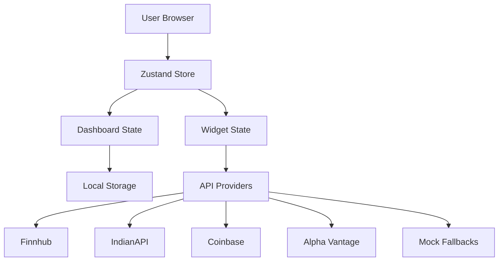

# FinBoard - Customizable Finance Dashboard

A modern, real-time finance dashboard builder that allows users to create customizable widgets for monitoring stocks and financial data through multiple API providers.

## Features

### Dashboard System
- **Template System**: Choose from pre-built templates like "Starter Dashboard", "Indian Market", or "Crypto Tracker".
- **Multi-Dashboard Support**: Switch between different specialized dashboards without losing your custom configurations.
- **Auto-Persistence**: All changes are automatically saved to your browser's local storage.
- **Export/Import**: Backup your entire dashboard setup as a JSON file and restore it on any device.

### Widget Ecosystem
- **Stock Quote Cards**: Real-time price display with dynamic change indicators and key market metrics.
- **Advanced Charts**: Interactive Line, Area, and Candlestick charts with multiple time intervals.
- **Market Watchlists**: Track a collection of assets in a compact, real-time list.
- **Data Tables**: Powerful tabular view with sorting, search, and pagination for large datasets.
- **Custom API Integration**: Connect to any public JSON API and map its fields to your own custom widgets.

### Technical Excellence
- **Intelligent Fallbacks**: Automatic fallback to high-quality mock data if API limits (429) or CORS issues occur.
- **State-of-the-Art Styling**: Premium dark mode design with glassmorphism, smooth animations, and responsive layouts.
- **Drag & Drop**: Seamlessly reorganize your dashboard using high-performance drag-and-drop.
- **Theme Support**: Dynamic light/dark theme switching with system preference detection.

## Architecture

### System Overview
FinBoard is built as a highly modular React application using a centralized state management approach.



### Data Flow
1. **State Initialization**: On mount, the application rehydrates its state from `localStorage`.
2. **Widget Rendering**: The `DashboardGrid` renders widgets based on the stored configuration.
3. **Data Fetching**: Each widget uses the custom `useWidgetData` hook to fetch data via its assigned `ApiProvider`.
4. **Resiliency Layer**: If a fetch fails (Rate limit/CORS), the provider logic transparently switches to the `MockDataGenerator`.
5. **UI Updates**: Zustand triggers re-renders across the grid, ensuring real-time feel even with multiple concurrent updates.

## Tech Stack

- **Framework**: React 18 with TypeScript
- **Styling**: Tailwind CSS & Vanilla CSS
- **State Management**: Zustand
- **Data Visualization**: Recharts
- **Drag & Drop**: @dnd-kit
- **Animations**: Framer Motion
- **UI Components**: shadcn/ui
- **Build Tool**: Vite

## Project Structure

```
src/
├── components/
│   ├── dashboard/      # Grid and Layout components
│   ├── layout/         # Header and Navigation
│   ├── ui/             # Reusable UI primitives (shadcn)
│   └── widgets/        # Specialized widget implementations
├── hooks/              # Custom React hooks (useToast, useWidgetData)
├── lib/                # API Services, Utilities, and Constants
├── store/              # Zustand Store (Dashboard Logic)
├── types/              # Collective TypeScript definitions
└── pages/              # Main Route Entry points
```

## Getting Started

### Installation

```bash
# Clone and install
git clone <repository-url>
cd finboard
npm install

# Start development
npm run dev
```

### Build for Production
```bash
npm run build
```

## Usage Guide

1. **Setup**: Switch to a template using the "Templates" button in the header.
2. **Customize**: Add new widgets using the "Add Widget" dialog.
3. **Organize**: Drag widgets by their handle to rearrange your layout.
4. **Maintenance**: Use the "Reset Dashboard" option in the menu if you want to revert to the default template state.
5. **Portability**: Use Export/Import to move your dashboard between browsers.
